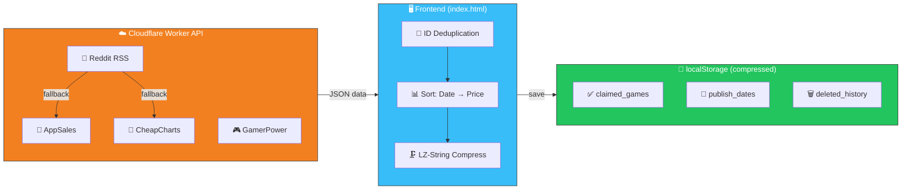

  <h1>🎮 LootRadar</h1>
  
<i>The ultimate, zero-build web dashboard for tracking free games and limited-time deals across the multiverse. Runs entirely in your browser!</i>

  
  
  
   
  
  
  
  
  
  
   
  
  
  
  
  
  

    

  
  
  

---

### ✨ Features
* 🌍 **Universal Tracking:** Automatically scrapes and aggregates free game deals from Steam, Epic Games, Prime Gaming, GOG, Ubisoft, iOS, Android, and Consoles. Powered by **Cloudflare Worker API** with multi-source fallback: Reddit RSS → AppSales (Android) / CheapCharts (iOS). Features **ID-based deduplication** with persistent publish date tracking across data sources!
* 💰 **My Loot Library & Wallet:** Keep a permanent record of every game you claim. The app automatically calculates your **Total Lifetime Savings**. Manage your library with precision by removing expired, failed, or paywalled games (featuring custom visual UI states) to keep your financial stats 100% accurate, with full support to reclaim them later!
* 📊 **Loot Analytics Dashboard:** A zero-dependency, 100% Vanilla JS and SVG-powered statistics dashboard. Features interactive Donut Charts for platform breakdowns, monthly activity Bar Charts, and a Robinhood-style Line Chart with an interactive date scrubber to track your lifetime wealth generation.
* 🗜️ **Extreme Storage Optimization:** Utilizes **LZ-String UTF-16 Compression** directly on local storage, shrinking save data by up to 90%. This bypasses standard 5MB browser limits, allowing users to effortlessly store over **100,000+ items** locally. Features seamless background "Auto-Healing" to upgrade legacy V1 saves without data loss.
* ☁️ **Cloud Sync (PIN Transfer):** Securely migrate your claimed games library, deleted item history, and total savings to another device in seconds using a 15-minute 5-digit PIN (Powered by Cloudflare Workers & highly-compressed payloads).
* 📱 **Native App Experience & Fluid UI:** Fully installable as a PWA on iOS and Android. Features mobile-native interactions like **Pull-to-Refresh**, context-aware **Scroll-to-Top**, and desktop-optimized **Mouse Drag-to-Scroll** navigation. Wrapped in a slick glassmorphism UI with flawless Z-index sliding animations.
* 🌐 **International Support (9 Languages):** Fully localized in English, 简体中文, Español, Français, Deutsch, Русский, 日本語, 한국어, and Português (Including dynamic translations for all charts and analytics).
* 🛡️ **Advanced Security:** Built-in Domain Lockdown and Anti-Debugger/Inspect Element blockers to prevent unauthorized scraping or cloning of the app.
* 🌓 **Dynamic Theming:** Seamless Light and Dark mode toggling.
* ⚡ **Lightning Fast Performance:** Highly optimized DOM rendering uses Document Fragments, **Background Pre-rendering**, and decoupled CSS transitions to instantly load, filter, and render hundreds of games with zero layout thrashing or lag.

---

### 🚀 Zero-Build Setup

No Node.js, Webpack, or Vite required! The entire application runs natively in a **single `index.html` file**.

1. Clone or download this repository.
2. Open `index.html` directly in any modern web browser.

> [!WARNING]
> **Domain Security Lock:** For security purposes, this application is domain-locked. If you wish to host it yourself, you must add your domain to the `allowedDomains` array at the very top of the `index.html` file, otherwise it will trigger a Security Alert and halt execution.

---

### 📱 Installing on your Phone (PWA)

You can install LootRadar to use exactly like a native mobile app!

* **iOS (Safari):** Tap the **Share** icon at the bottom of the screen and select **"Add to Home Screen"**.
* **Android (Chrome):** Tap the browser menu (three dots) and select **"Install App"** or **"Add to Home screen"**.

---

### 📖 How to Use

1. **Scan for Loot:** Open the app to trigger an automatic scan of current free games. Use the platform filters at the top to narrow down your search.
2. **Claim Games:** Tap the **Claim Now** button on any game card to be taken directly to the store page.
3. **Track Savings:** Once claimed, the game moves to your "Loot Library" and its original price is added to your total savings wallet.
4. **Device Sync:** Tap the Disclaimer/Info icon (ℹ️) to access the Device Sync menu. Generate an Export PIN on your old device, and enter it on your new device to instantly transfer your library!

---

### 📄 License & Usage

* **Non-Commercial Use Only:** This project is strictly for personal, educational, and non-commercial use. You may not use this application, its source code, or its scraping logic for any business, commercial, or monetized purposes.
* **Forks & Attribution:** You are welcome to fork, modify, and experiment with this code for your own personal projects! However, if you share your forked version, **you must provide proper citation** to the original author (Amos) and include a direct link back to this repository.

---

### 🏗️ Architecture

---

### ⚖️ Disclaimer

Games are fetched via third-party APIs and community web scraping (Reddit RSS, AppSales.net, CheapCharts, GamerPower). Offers are time-limited. Always verify that the final price on the store page is "Free" or "0.00" before confirming any purchase. LootRadar is an independent tracker and is not affiliated with Steam, Epic Games, Apple, Google, or other listed platforms.

---

  <b>Designed and Developed by Amos</b>
   
  <i>Tracking freebies so you don't have to.</i>

